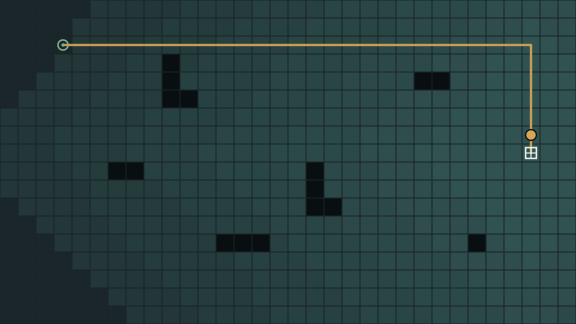
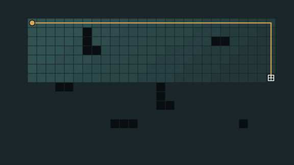

<h1 align="center">Rationauts</h1>

<p align="center">
  A colony-building game whose tech tree is the classical AI curriculum.
</p>

<p align="center">
  <a href="https://github.com/irisgli/rationauts/actions/workflows/ci.yml"></a>
  <a href="LICENSE"></a>
  
  
</p>

<h3 align="center">
  <a href="https://irisgli.github.io/rationauts/">Play</a>
  <span> · </span>
  <a href="docs/design/0001-rationauts.md">Design</a>
  <span> · </span>
  <a href="docs/adr">Decisions</a>
  <span> · </span>
  <a href="docs/ROADMAP.md">Roadmap</a>
  <span> · </span>
  <a href="CONTRIBUTING.md">Contributing</a>
</h3>

---

Your bots start as reflex agents: they step toward what they want and get stuck on the
first wall. You make them smarter by installing techniques — breadth-first search, then
uniform-cost, then A\* — and every map is built so the previous one _visibly fails_
before the next is unlocked.

<table>
<tr>
<th align="center" width="50%">Uniform-cost search · <code>513</code> tiles examined</th>
<th align="center" width="50%">A* · <code>182</code> tiles examined</th>
</tr>
<tr>
<td></td>
<td></td>
</tr>
</table>

Same route, same cost. The only difference is how much of the map each had to look at.

## Getting started

```bash
pnpm install
pnpm dev
```

```bash
pnpm verify      # format, lint, typecheck, test — exactly what CI runs
pnpm sim bench   # every planner against every scenario, headless
```

Requires Node 22+ and pnpm 10+.

## Packages

| Package                                 | Description                                                                                                 |
| --------------------------------------- | ----------------------------------------------------------------------------------------------------------- |
| [`@rationauts/core`](packages/core)     | Deterministic simulation engine. No AI, no DOM, no dependencies.                                            |
| [`@rationauts/agents`](packages/agents) | Classical AI algorithms. Depends on nothing, [deliberately](docs/adr/0004-algorithms-are-game-agnostic.md). |
| [`@rationauts/sim`](packages/sim)       | Scenarios, runners, metrics, replay, benchmark CLI.                                                         |
| [`@rationauts/app`](packages/app)       | Browser client and search overlays.                                                                         |

---

<p align="center">
  Curriculum follows CMU <a href="https://www.cs.cmu.edu/~15281-f23/">15-281</a> and UC Berkeley <a href="https://inst.eecs.berkeley.edu/~cs188/fa26/">CS 188</a>.<br>
  No course code or assets are used — see <a href="docs/adr/0005-no-course-materials-are-vendored.md">ADR 5</a>.
</p>

<p align="center">
  <a href="LICENSE">MIT</a>
</p>
